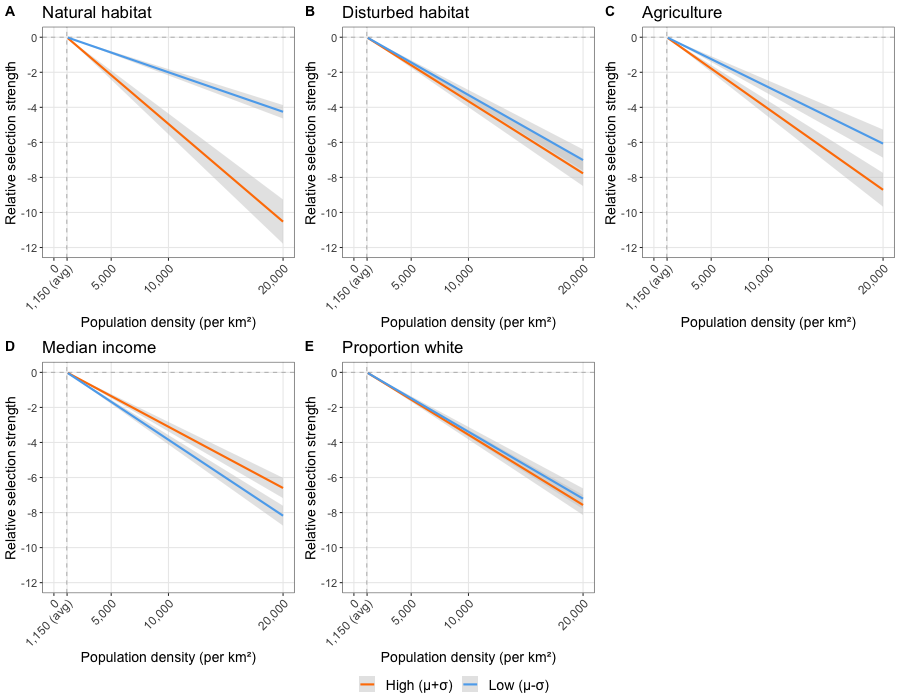

# Effects of Social and Environmental Characteristics on Coyote Human-Tolerance Behavior

## Background
As urbanization expands and more wildlife adapt to living in these environments, 
managing human-wildlife interactions is increasingly important. Wildlife’s 
tolerance for humans i.e., their willingness to overlap with humans spatially 
and temporally, is a key factor mediating the frequency and nature of an animal’s 
interactions with humans.  While intrinsic processes influencing human tolerance 
have been identified, little is known about the extrinsic causes. We explored 
the effect of urban environmental features in coyotes, a species of particular 
management concern due to their status as a relatively large predator. Using the 
GPS data of previously collared animals, we estimated human-tolerance behavior 
by quantifying their spatial and temporal overlap with humans and estimated the 
effect of environmental characteristics on human-tolerance behavior. Importantly, 
included human socioeconomic and demographic characteristics because of the 
strong relationship between these characteristics and aspects of the urban 
environment and human behavior important to coyote ecology. 

## Results
We found that 
environmental characteristics – proportion of natural habitat, disturbed habitat, 
and agriculture – had a negative effect on human-tolerance behavior. Median 
income had a positive effect on human-tolerance behavior. This study reinforces 
research indicating that suitable habitat is key for supporting sustainable 
wildlife populations and coexistence with humans and adds to a growing literature 
showing human social system attributes are importants drivers of urban wildlife 
ecology.

Figure 1. Predicted effects of natural habitat (a), disturbed habitat (b), agriculture 
(c), median income (d), and proportion white residents (e) on human-tolerance behavior,
i.e., relative selection strength across standardized human population densities. 
Model predictions were generated using high (mean + sd) and low (mean - sd) 
values of the focal social or environmental variable. Variables not included in 
the focal interaction were set to their mean. Shading is 95% CI. 

## Files

### hmm_behavior_states.R
Subset coyote GPS data to periods of high human activity and identify bursts of
movement behavior with a hidden Markov model.
#### Data
- gps_data.rdata: contains the GPS coordinates (long/lat) of multiple animals 
identified by their IDs, i.e. "COY_ID"

### step_selection_analysis.R
Estimate human-tolerance behavior by estimating selection for human population 
density with a conditional logistic regression. Model includes interaction terms 
between environmental and socioeconomic/demographic characteristics and population
density to estimate their effect on human-tolerance behavior.
#### Data
- gps_ssf.rdata: output from hmm_behavior_states.R which includes movement data 
from periods of high human activity
- raster.grd: raster containing environmental and socioeconomic/demographic
geospatial data (see: https://github.com/zepedae/social-environmental-raster.git)

### plot_results.R
Create interaction plots to visualize effects of environmental and socioeconomic/
demographic characteristics on human-tolerance behavior.
#### Data
- ssf_data.rdata: GPS data and random location generated in step_selection_analysis.R
- ssf_fit.rdata: conditional logistic regression model built in step_selection_analysis.R

